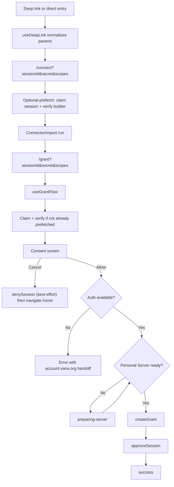

# Grant + Connect Flow Architecture

## Purpose

Describe the current grant and connect flow as implemented in the app so route
ownership, canonical inputs, auth handoff, and failure behavior are clear.

This doc is intended to be architectural source of truth for the current flow.
It replaces older transition docs that described intermediate auth and routing
models.

## Scope

This document covers:

- deep-link entry and URL normalization
- `/connect` route ownership
- `/grant` route ownership
- auth restoration and Personal Server readiness
- session approval and split-failure recovery

This document does not cover:

- updater behavior
- connector implementation internals
- detailed UI copy or visual design

## Core principles

### Canonical inputs live in the URL

For real grant sessions, the canonical route inputs are:

- `sessionId`
- `secret`
- `scopes`

Optional URL inputs:

- `appId` for supplemental app/context resolution
- `status=success` to force success UI
- `masterKeySig` when auth is being restored from a deep link

`location.state` is not canonical. It may carry pre-fetched session and builder
data from `/connect` to `/grant` as a performance optimization only.

### Consent happens before grant creation

The user sees the builder and requested scopes before the app creates a grant.
The protocol side effects happen only after consent and after auth is available.

### Auth is restored, not launched, by the grant route

The current grant route does not own a dedicated in-flow auth launch step.
Instead:

- auth may already exist in app state
- auth may be restored from `masterKeySig` in a deep link
- if auth is missing, the grant route surfaces an error directing the user to
  the external account flow

### Personal Server readiness is part of the flow contract

Grant approval depends on the Personal Server being ready with both:

- a local port
- a public tunnel URL

If auth exists but the server is still starting, the grant route enters
`preparing-server` and auto-resumes approval once the server is ready.

## End-to-end flow



## Route ownership

### `/connect`

The connect route is responsible for:

- parsing canonical params from the URL
- resolving the primary data source from `scopes` and optional `appId`
- prefetching session claim and builder verification for real grant sessions
- launching the connector/import runtime
- navigating to `/grant` with canonical query params
- passing pre-fetched data in `location.state` when available

Important behavior:

- for grant sessions, it does not infer fallback app scopes if canonical inputs
  are missing
- if the connector is already connected for a real grant session, it may skip
  directly to `/grant`
- prefetch failures fail soft; the grant route can still perform claim/verify

### `/grant`

The grant route is responsible for:

- loading session and builder data, either from prefetch or fresh network calls
- rendering consent, loading, error, and success states
- requiring auth before approval
- waiting for Personal Server readiness
- creating the grant via Personal Server
- approving the session via Session Relay
- denying the session on cancel as a best effort

## Runtime states

The current grant flow states are:

```text
loading → claiming → verifying-builder → consent → preparing-server → creating-grant → approving → success
```

Notes:

- `preparing-server` is entered only after the user has consented and auth is
  available, but the Personal Server is not yet ready
- there is no current `auth-required` state in the route state machine
- `status=success` can force the success UI regardless of the earlier path

## Auth and deep-link behavior

`useDeepLink` is responsible for normalizing external entry into app routes.

Current behavior:

- `vana://connect?...` deep links are normalized into `/connect` or `/grant`
- when `masterKeySig` is present, the app derives the wallet address and restores
  auth state
- special auth-only session IDs may redirect to a dedicated route such as
  `/personal-server`

This means the flow architecture depends on deep-link normalization as part of
runtime state restoration, not just navigation.

## Session and builder verification

For real grant sessions:

1. claim the session with `sessionId` and `secret`
2. read `granteeAddress`, `scopes`, `expiresAt`, and related session metadata
3. verify the builder via Gateway plus manifest discovery
4. block consent if builder verification fails in the non-prefetched path

If `/connect` already completed some or all of that work, `/grant` may reuse it.

## Approval path

Once the user clicks Allow and auth is available:

1. wait for Personal Server readiness
2. create the grant through Personal Server `POST /v1/grants`
3. fetch the Personal Server identity for builder-facing resolution
4. save a pending approval record locally
5. call Session Relay `POST /v1/session/{id}/approve`
6. clear the pending approval record
7. surface success and update connected-app UI state

## Split-failure recovery

If grant creation succeeds but session approval fails, the app stores a pending
approval record and retries approval once on next app startup.

This protects against the split-failure case where:

- the grant exists on Gateway
- the builder was never told about it

The retry is single-shot and clears stale records regardless of outcome to avoid
infinite retry loops on expired sessions.

## Deny behavior

If the user clicks Cancel on the consent screen:

- the app makes a best-effort `denySession` call for real sessions
- deny failure does not block navigation away
- the route then navigates home

## Demo and special cases

- demo sessions are identified by `grant-session-*` in dev mode
- demo sessions skip the real relay/builder/personal-server network path
- non-grant connect entries may still use app-level context such as `appId`, but
  that is not the canonical contract for real grant sessions

## Where to look

- URL parsing/building: `src/lib/grant-params.ts`
- Deep-link normalization: `src/hooks/use-deep-link.ts`
- Connect orchestration: `src/pages/connect/use-connect-page.ts`
- Grant orchestration: `src/pages/grant/use-grant-flow.ts`
- Session Relay client: `src/services/sessionRelay.ts`
- Builder verification: `src/services/builder.ts`
- Personal Server client: `src/services/personalServer.ts`
- Pending approval retry: `src/hooks/usePendingApproval.ts`
